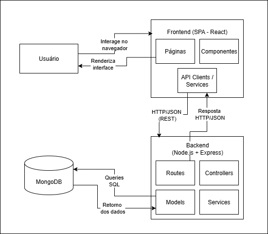

# Análise da Arquitetura de Software

## Identificação
O sistema **Adote-Fácil** adota uma arquitetura **monolítica em camadas**, 
separando responsabilidades entre frontend e backend.

- **Frontend**: aplicação SPA em React, organizada em páginas e componentes.
- **Backend**: API REST em Node.js, estruturada em camadas:
  - `models`: modelos de dados (MongoDB via Mongoose).
  - `controllers`: lógica de aplicação.
  - `routes`: definição de endpoints.
  - `services`: regras de negócio e funções de apoio.

## Justificativa
- A divisão clara em camadas facilita a manutenção e evolução do sistema.
- A escolha por monólito simplifica o deploy e a configuração para ambientes acadêmicos.
- A arquitetura segue princípios do **MVC**, ainda que a camada de visão seja substituída pelo frontend React.

## Diagrama de Componentes
